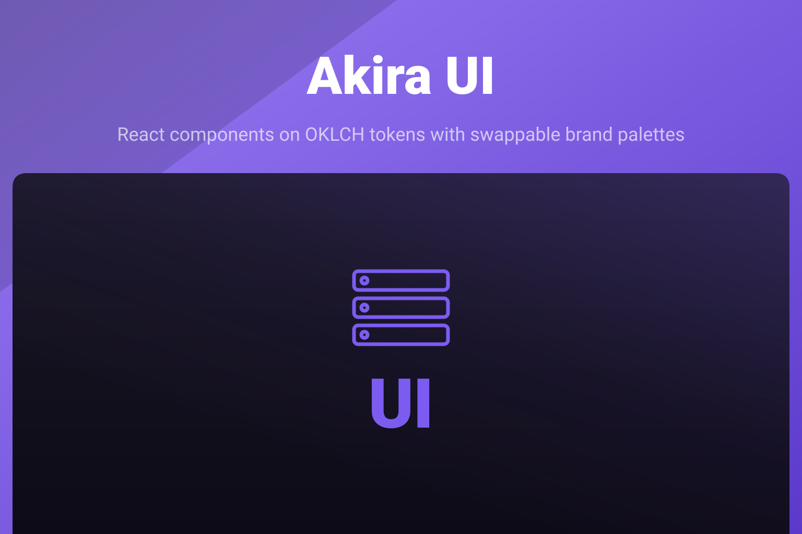

<p align="center">
  
</p>

<p align="center">
  
  
  
</p>

Open-source React component library: the full shadcn/ui (New York) set on an OKLCH design-token system,
plus a handful of blocks and application shells built on top of it. The default palette is Akira purple.
Swap it for your own brand with a single CSS import, no component code changes required.

## Install

```bash
bun add @akira-io/ui
```

```bash
# npm
npm install @akira-io/ui

# pnpm
pnpm add @akira-io/ui

# yarn
yarn add @akira-io/ui
```

Peer dependencies: `react` and `react-dom`, 18 or 19. `@inertiajs/react` is only needed if you import from
the `/inertia` entry point; `react-hook-form` is only needed for the `<Form>` component. Neither is required
for the primitives, the blocks, or the generic shells.

## Theme (Tailwind v4)

Import the tokens once, in your app's main CSS:

```css
@import 'tailwindcss';
@plugin 'tailwindcss-animate';
@import '@akira-io/ui/theme.css';
@source '../../node_modules/@akira-io/ui/dist';
```

`tailwindcss-animate` generates the `animate-in` / `fade-in` / `zoom-in` utility classes several components
use for enter and exit transitions (dialogs, dropdowns, tooltips). `@source` points Tailwind at the compiled
package output so those utility classes are not purged.

No configuration is required to get the default Akira purple palette: `theme.css` sets `--primary` from the
Akira ramp in both light and dark mode.

### Switching brands

Import a brand preset after `theme.css` and set `data-brand` on `<html>`:

```css
@import '@akira-io/ui/theme.css';
@import '@akira-io/ui/themes/nosferry.css';
```

```html
<html data-brand="nosferry"></html>
```

`themes/nosferry.css` ships today as the worked example: it declares the required `--primary` /
`--primary-foreground` pair and the optional `--destructive` / `--destructive-foreground` pair for both
light and dark mode, eight declarations in total, scoped to `[data-brand='nosferry']`. Every preset must
declare the primary pair in both schemes; it may add the destructive pair only as a complete pair in both
schemes. Write your own preset the same way and ship it alongside your app; omitting `data-brand` renders
Akira purple.

## Use components

```tsx
import { Button, Card, cn } from '@akira-io/ui';

export function Example() {
    return (
        <Card>
            <Button className={cn('gap-2')}>Continue</Button>
        </Card>
    );
}
```

The package is framework-agnostic at its core: the primitives and the tokens work in any React app (Inertia,
Next.js, plain Vite). Only the application shells need a router, and they take it as a prop rather than
importing one.

## Subpath exports

| Import                      | Contents                                                                                                    |
| --------------------------- | ----------------------------------------------------------------------------------------------------------- |
| `@akira-io/ui`              | 56 React components + `cn` (zero framework coupling)                                                         |
| `@akira-io/ui/blocks`       | 8 higher-level blocks: command palette, stat cards, settings cards, tour, and more                          |
| `@akira-io/ui/shells`       | 12 application shell pieces: sidebar, header, nav, settings layout; take a polymorphic `linkComponent` prop |
| `@akira-io/ui/inertia`      | The same shells with the Inertia `Link` and `usePage().url` pre-bound                                       |
| `@akira-io/ui/theme.css`    | The design tokens                                                                                           |
| `@akira-io/ui/themes/*.css` | Brand presets (`nosferry.css` ships as the example)                                                         |
| `@akira-io/ui/locales/pt`   | Portuguese labels for the components that take them, as a typed object to spread                            |

Component text defaults to English. To render an app in Portuguese, hand the bundle to the locale provider
once, at the root; every localized component reads it, and a prop still wins on the screen that needs it:

```tsx
import { UiLocaleProvider } from '@akira-io/ui';
import { ptLabels } from '@akira-io/ui/locales/pt';

<UiLocaleProvider labels={ptLabels}>
    <App />
</UiLocaleProvider>;
```

## Documentation

Full documentation starts at [`docs/00-index.md`](docs/00-index.md):

- [Installation](docs/01-installation.md)
- [Theme & Tokens](docs/02-theme-and-tokens.md)
- [Components](docs/03-components.md)
- [Shells](docs/04-shells.md)
- [Adoption Guide](docs/05-adoption-guide.md)
- [Development & Release](docs/06-development.md)

The hosted documentation and live component preview are available at [ui.akira-io.com](https://ui.akira-io.com).

## Testing

```bash
bun run test
```

## Changelog

Release notes are generated from conventional commits via [git-cliff](https://git-cliff.org) when a
`vX.Y.Z` tag is pushed (see `cliff.toml` and `.github/workflows/release.yml`). `CHANGELOG.md` appears in the
repository after the first tagged release.

## Contributing

Please see [CONTRIBUTING.md](CONTRIBUTING.md) for details.

## Security

Please review [SECURITY.md](SECURITY.md) for how to report a vulnerability.

## Credits

- [Kidiatoliny](https://github.com/kidiatoliny)
- [All Contributors](https://github.com/akira-io/ui/graphs/contributors)

## License

MIT. See [LICENSE](LICENSE).
